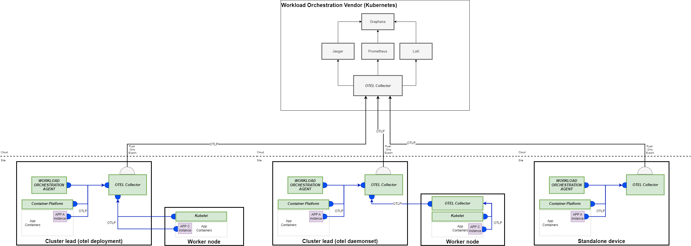

# Research Prototype Project

The purpose of this research prototype project is enable the creation of a virtual environment that can be used to help validate the [Application Observability](https://specification.margo.org/app-interoperability/observability/) section of the Margo specification.

In order to help validate the different supported deployment types, how observability data is collected, and what observability data is required to be collected the prototype has configurations to support three different deployment options.

1. Deploying a single OTEL collector to a multi-node Kubernetes cluster and sending the data via OLTP to an environment representing the workload orchestration/observability platform vendor
2. Deploying multiple OTEL collectors, using the daemonset deployment model, to a multi-node Kubernetes cluster and sending data via OLTP to an environment representing the workload orchestration /observability platform vendor
    >**Note**: Since a single-node Kubernetes cluster is just an easier configuration of 1 and 2 we are not including that in the prototype.
3. Deploying a single OTEL collector to a device running Docker and sending the data via OLTP to an environment representing the workload orchestration/observability platform vendor

>**Warning:** The scripts and files contained in this folder are for research purposes only and do not represent how this should be done for production scenarios.
